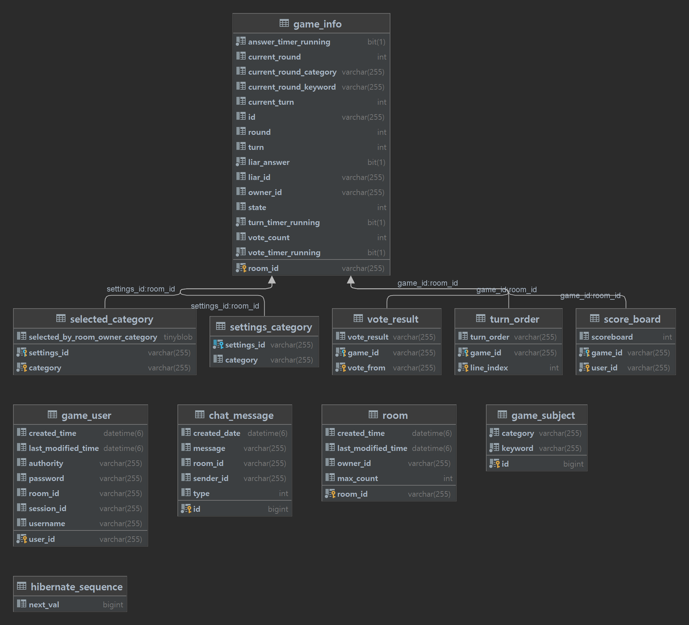
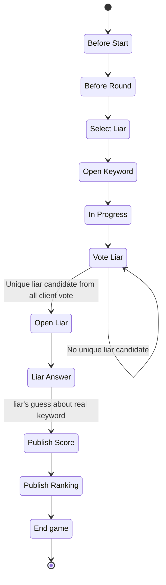
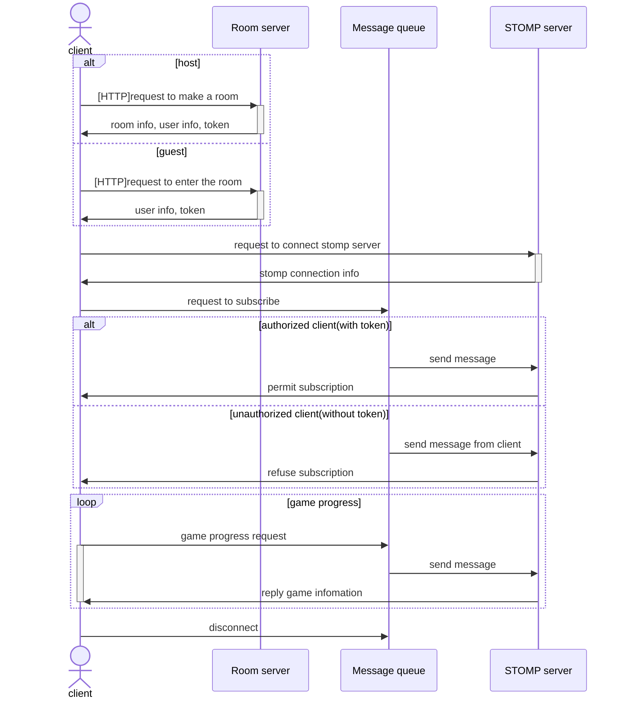

# What is Liar Game?
The Liar Game is a game to find the liar. Each round consists of one liar and other citizens. When the game starts, the categories are open to everyone, and the keywords are open to citizens except Liar. The game progress is as follows. Everyone takes turns explaining keywords. Liar must infer keywords from other people's explanations and pretend to be a citizen. Liar also has to explain, of course. When the explanation is over, people find a liar through voting.

# What is your project?
This is a web-based Liar Game.

# LiarGameServer
This repository implements a server for our web-based Liar Game.

* Tech stack
    * Spring boot
    * Mysql
    * Spring security
    * Spring Data JPA
    * websocket(STOMP)
    * Message queue(RabbitMQ)

## BUILD
The server can be built with gradle.

Windows
```
gradlew clean build
```
Linux
```
./gradlew clean build
```

## Execute
Since the main server is linked with db, *the jasypt password may be required.* You will need to build the db yourself and modify application.yml file. See application.yml for details.

```
java -jar liar-0.0.1-SNAPSHOT.jar
```

## Architecture
### 1. ERD


### 2. State Diagram
This is game server state diagram.


### 3. Sequence Diagram
This is game 
